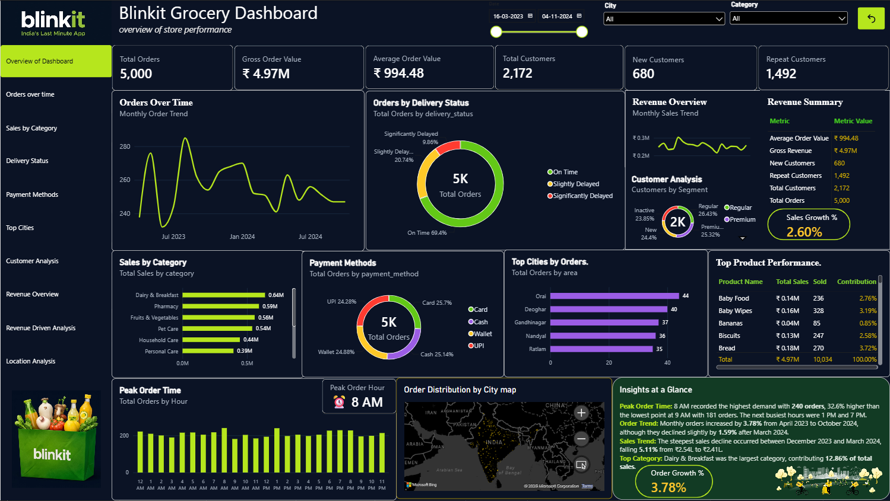
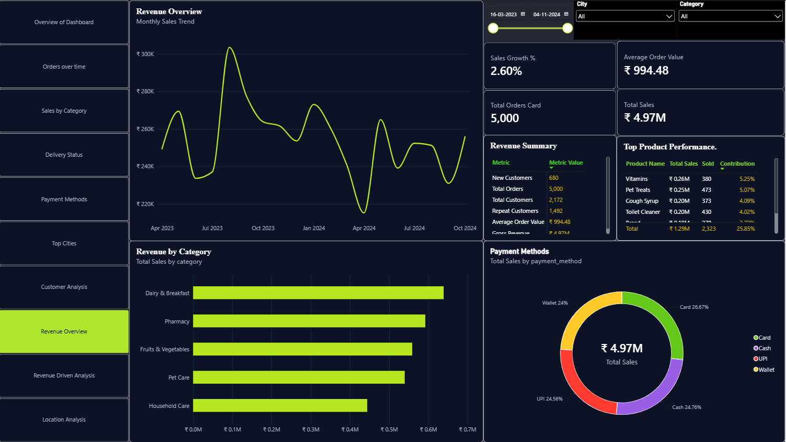
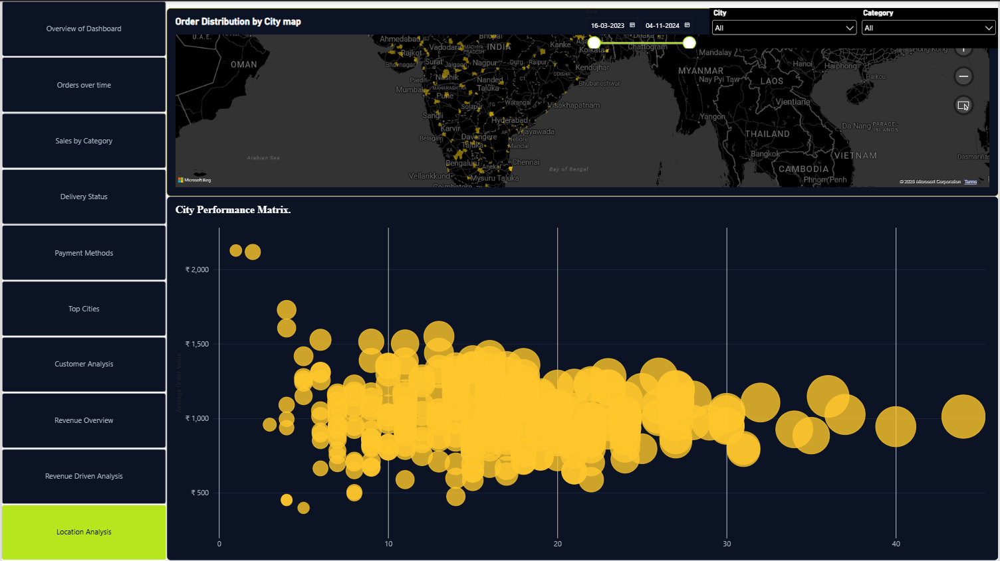

# Blinkit Grocery Sales Dashboard

## Project Overview

This Power BI dashboard provides an end-to-end analysis of Blinkit's
sales, orders, customers, delivery performance, products, revenue and
geographical distribution.

## Key Metrics

- Total Sales: ₹4.97M
- Total Orders: 5,000
- Average Order Value: ₹994.48
- Total Customers: 2,172
- New Customers: 680
- Repeat Customers: 1,492
- Quantity Sold: 10,034
- Order Growth: 3.78%
- Sales Growth: 2.60%
- Peak Order Time: 8 AM

## Dashboard Pages

1. Overview of Dashboard
2. Orders Over Time
3. Sales by Category
4. Delivery Status
5. Payment Methods
6. Top Cities
7. Customer Analysis
8. Revenue Overview
9. Revenue Driver Analysis
10. Location Analysis

## Key Insights

- The highest order volume occurred at 8 AM with 240 orders.
- The lowest order volume occurred at 9 AM with 181 orders.
- Monthly orders increased by 3.78% from April 2023 to October 2024.
- Dairy & Breakfast contributed 12.86% of total sales.
- On-time deliveries accounted for 69.40% of total orders.
- Slightly delayed deliveries accounted for 20.74%.
- Significantly delayed deliveries accounted for 9.86%.

## Tools and Technologies

- Power BI
- Power Query
- DAX
- Data Cleaning
- Data Modelling
- Business Intelligence
- Data Visualization

## Data Model

The dashboard uses a star-schema-based model containing:

- FactSales
- DimCustomer
- DimProduct
- DimDate

## Dashboard Preview

## How to View the Dashboard

1. Download `Blinkit_Sales_Dashboard.pbix`.
2. Install Power BI Desktop.
3. Open the downloaded PBIX file in Power BI Desktop.

## Data Source

The dataset used for this project was obtained from Kaggle.

## Author

Deepa Soman
